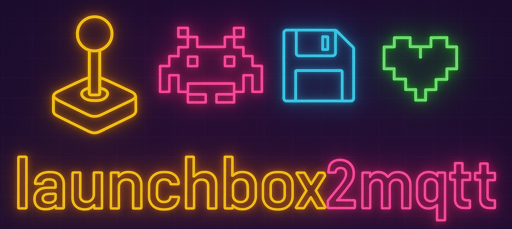

[](https://github.com/ezand/launchbox2mqtt/actions/workflows/build.yml)
[](https://choosealicense.com/licenses/mit/)


> ⚠️ **Work in Progress**: This project is under active development and not ready for production use. Features may be
> incomplete, APIs may change, and bugs are expected.

# launchbox2mqtt

A LaunchBox plugin that bridges LaunchBox events to MQTT, enabling real-time monitoring and automation of retro
gaming sessions.

## Features

- **Game Lifecycle Events**: Publishes MQTT messages when games are launched, running, and exited
- **Emulator Events**: Tracks emulator loading and execution state
- **System Events**: Monitors LaunchBox and BigBox state changes
- **Game Metadata**: Publishes detailed game and emulator information as JSON
- **Configuration UI**: Easy-to-use dialog for MQTT broker settings
- **Secure Credentials**: Password encryption using Windows DPAPI
- **Debug Logging**: File-based logging to `<LaunchBox>/Logs/launchbox-mqtt-debug.log`

## MQTT Topics

The plugin publishes to the following topics:

### Game/Content Events

| Topic                           | Payload    | Retained | Description                       |
| ------------------------------- | ---------- | -------- | --------------------------------- |
| `launchbox/content/loaded`      | `on`/`off` | No       | Content (game) is loaded          |
| `launchbox/content/running`     | `on`/`off` | No       | Content is currently running      |
| `launchbox/content`             | Game title | No       | Currently loaded game title       |
| `launchbox/content/last_played` | Game title | Yes      | Last played game title (retained) |
| `launchbox/content/details`     | JSON       | Yes      | Full game metadata (retained)     |

### Emulator Events

| Topic                            | Payload        | Retained | Description                               |
| -------------------------------- | -------------- | -------- | ----------------------------------------- |
| `launchbox/emulator/loaded`      | `on`/`off`     | No       | Emulator is loaded                        |
| `launchbox/emulator/running`     | `on`/`off`     | No       | Emulator is currently running             |
| `launchbox/emulator`             | Emulator title | No       | Currently loaded emulator                 |
| `launchbox/emulator/last_loaded` | Emulator title | Yes      | Last loaded emulator (retained)           |
| `launchbox/emulator/details`     | JSON           | Yes      | Emulator configuration details (retained) |

### System Events

| Topic                      | Payload    | Retained | Description                    |
| -------------------------- | ---------- | -------- | ------------------------------ |
| `launchbox/running`        | `on`/`off` | No       | LaunchBox application state    |
| `launchbox/bigbox/running` | `on`/`off` | No       | BigBox mode state              |
| `launchbox/bigbox/locked`  | `on`/`off` | No       | BigBox locked state            |
| `launchbox/system/event`   | Event name | No       | Other system events (fallback) |

## Installation

### Option 1: Download Pre-built Release

1. Download the latest `MQTTPlugin-*.zip` artifact from [GitHub Actions](https://github.com/ezand/launchbox2mqtt/actions)
2. Extract the contents to `<LaunchBox Installation>/Plugins/MQTTPlugin/`
3. Restart LaunchBox

### Option 2: Build from Source

**Prerequisites:**

- [.NET 9.0 SDK](https://dotnet.microsoft.com/download/dotnet/9.0)

**Build Steps:**

```bash
# Clone the repository
git clone https://github.com/ezand/launchbox2mqtt.git
cd launchbox2mqtt

# Build in Release mode
dotnet build -c Release

# The plugin files will be in:
# MqttPlugin.Launchbox.Core/bin/Release/net9.0-windows/MQTTPlugin/
```

**macOS/Linux Build:**

The project targets Windows-specific APIs but can be built on macOS/Linux:

```bash
dotnet build -c Release
```

The `EnableWindowsTargeting` property allows cross-platform builds. The resulting DLL will only run on Windows.

**Install:**

1. Copy the entire `MQTTPlugin` folder to `<LaunchBox Installation>/Plugins/`
2. Restart LaunchBox
3. Verify installation by checking `Tools > MQTT Configuration` menu item

## Configuration

### MQTT Broker Settings

Configure your MQTT broker connection via the LaunchBox GUI:

1. Open LaunchBox
2. Navigate to `Tools > MQTT Configuration` menu item
3. Click to open the configuration dialog
4. Enter your MQTT broker details:
   - **Host**: MQTT broker hostname or IP address (default: `localhost`)
   - **Port**: MQTT broker port (default: `1883`)
   - **Username**: Optional authentication username
   - **Password**: Optional authentication password
5. Click **Test Connection** to verify settings
6. Click **Save** to apply changes

**Security:**

- Passwords are encrypted using Windows DPAPI (Data Protection API)
- Encryption is user-scoped and machine-scoped
- Config stored in `<LaunchBox>/Plugins/MQTTPlugin/config.json`
- The MQTT connection automatically reconnects after saving new settings

**Default Configuration:**

If no configuration file exists, the plugin uses these defaults:

- Host: `localhost`
- Port: `1883`
- No authentication

### First Run

On first run without a config file, the plugin will log a warning and use default settings. Access the configuration dialog to set up your broker connection.

## Dependencies

- [MQTTnet 5.0.1.1416](https://github.com/dotnet/MQTTnet) - MQTT client library

## 📃 License

MIT License - see [LICENSE](LICENSE) file for details.
